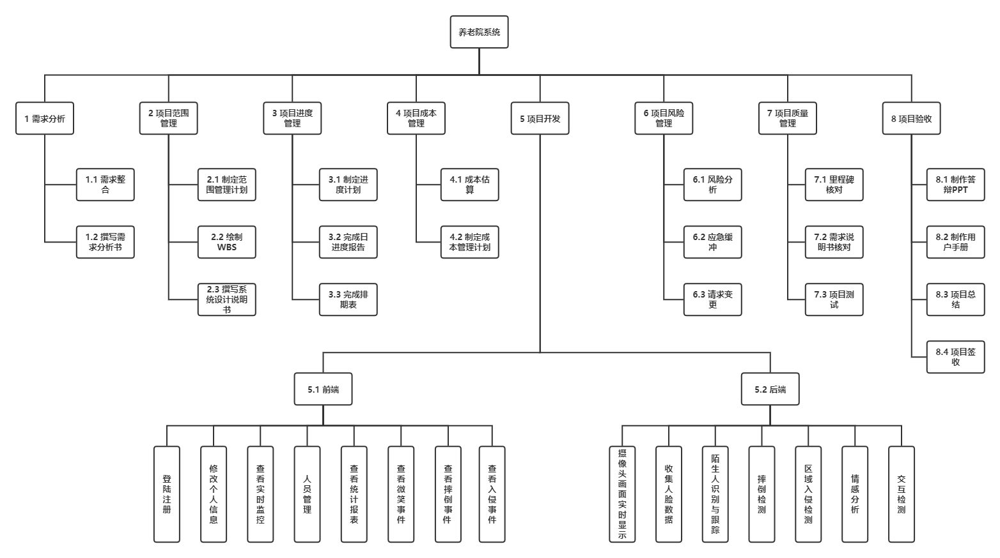
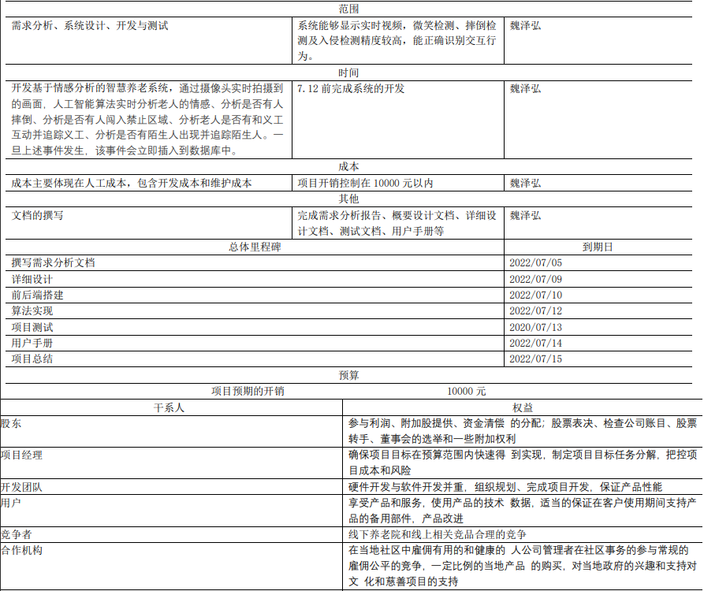

# 331智能养老院---项目章程

[TOC]

## 1 引言

### 1.1 目的

​	基于情感分析的智慧养老系统是一个人工智能项目。通过摄像头实时拍摄到的画面，人工智能算法实时分析老人的情感、分析是否有人摔倒、分析是否有人闯入禁止区域、分析老人是否有和义工互动并追踪义工、分析是否有陌生人出现并追踪陌生人。一旦上述事件发生，该事件会立即插入到数据库中。这些事件数据被实时地更新在报表中，管理人员因此可以迅速做出反应。

​	与传统家庭养老相比，智慧养 老系统打破了家庭养老时间和空间的限制，使得管理起来更加方便，可以让子女更加放心。同时，由于 其技术的创新型，符合老龄化的社会现实，可以吸引更多人才投入该领域，让更多的思维得到碰撞，提 升情感分析技术的交互发展，进而有效地提升基于情感分析的智慧养老系统的可用性。

### 1.2 使用场景

该系统运行在Linux环境下，应配备5个摄像头： 

- 1个摄像头放在电脑前，用于手机人脸数据 
- 1个摄像头挂在房间的墙上，检测是否有陌生人出现和检测哪位老人笑了，有陌生人或老人笑了便立即记录，并且追踪陌生人 
- 1个摄像头挂在走廊墙上，检测是否有人摔倒，有人摔倒便立即记录 
- 1个摄像头放在院子里，监控是否有人闯入禁止区域，有闯入便立即记录 
- 1个摄像头放在桌子上，当有义工访问才拿出来使用，用于监控义工和老人的交互，有交互便立即记录。记录有2层含义，1个是将截图保存起来，另一个是将事件插入到数据库中。与此同时，摄 像头的画面实时的显示在页面上，并录像保存到硬盘中。

### 1.3 整体架构

从技术架构划分，本系统分为2部分

1. Web端，其主要作用是 
   - 1）维护和统计老人、工作人员和义工的信息 
   - 2）收集他们的脸部数据（计算机视觉部分使用脸部数据训练人脸识别模型实现精准监控）
   - 3）通过实时报表实时展现报警信息 
2. 计算机视觉，其主要作用是 
   - 1）收集人脸数据 
   - 2）陌生人识别和追踪 
   - 3）老人情感分析 
   - 4）摔倒检测 
   - 5）禁止区域入侵检测 
   - 6）义工和老人交互检测 
   - 7）摄像头画面实时显示和录像

## 2 需求分析

### 2.1 前端

|     功能     | 详细描述                                                     |
| :----------: | :----------------------------------------------------------- |
|     注册     | 管理员可以注册账号并初次设置个人信息                         |
|     登录     | 管理员可以登录已有账号                                       |
| 修改个人信息 | 管理员可以修改个人信息，包括真实姓名、性别、邮箱、电话等     |
| 查看实时监控 | 管理员可以请求访问监控界面，选择监控机位，系统根据权限及机位状态显示监控画面 |
|   老人管理   | 管理员可以对老人信息进行增删改查                             |
|   员工管理   | 管理员可以对员工信息进行增删改查                             |
| 查看统计报表 | 管理员可以查看由老人信息所生成的数据报表                     |
| 查看微笑事件 | 系统进行情感分析，将老人开心的画面截图，并插入一条数据至数据库，管理员可以查看老人微笑事件 |
| 查看摔倒事件 | 系统进行摔倒检测，将老人摔倒的画面截图，并插入一条数据至数据库，管理员可以查看老人摔倒事件 |
| 查看入侵事件 | 系统划分监测区域，检测到有陌生人入侵监测区域，会将画面截图并插入一条数据至数据库，管理员可以查看入侵事件 |

### 2.2 后端

| 需求                     | 详细分析                                                     |
| ------------------------ | ------------------------------------------------------------ |
| 收集人脸数据             | 将老人、工作人员和义工的人脸图像收集起来，为训练人脸识别模型准备数据。人脸采集，需要用到人脸检测算法检测画面中是否有脸、有几张脸、和得到脸部坐标。 |
| 陌生人识别和追踪         | 发现有陌生人就报警，并追踪。发现陌生人会将截图保存到硬盘，并实时插入一条数据到数据库。一旦数据库有了新数据，Web端的实时报表会立即呈现。 |
| 摔倒检测                 | 检测是否有人摔倒。一旦检测到有人摔倒，会将截图保存到硬盘，并实时插入一条数据到数据库。一旦数据库有了新数据，Web端的实时报表会立即呈现。 |
| 禁止区域入侵检测         | 检测是否有人入侵禁止区域。一旦检测到有人入侵禁止区域，会将截图保存到硬盘，并实时插入一条数据到数据库。一旦数据库有了新数据，Web端的实时报表会立即呈现。 |
| 义工和老人交互检测       | 判断义工在和哪位老人互动。判断条件为：义工和老人的距离在1米之内；一旦检测到有交互，会将截图保存到硬盘，并实时插入一条数据到数据库。一旦数据库有了新数据，Web端的实时报表会立即呈现。 |
| 情感分析                 | 检测老人是否高兴。一旦老人笑了，会将截图保存到硬盘，并实时插入一条数据到数据库。一旦数据库有了新数据，Web端的实时报表会立即呈现。 |
| 摄像头画面实时显示和录像 | 摄像头采集捕获实时画面。Web端会实时进行视频的播放。          |

## 3 风险分析

1. 范围风险：项目进行过程中，由于内外部环境因素变化导致用户的需求或适用场景发生变化；

2. 进度风险：由于技术因素项目未能达到预期的效果；计划设定不合理；项目概念较新颖，项目人员经验不足导致项目工期拖延；

3. 成本风险：由于硬件材料成本变动或开发费用变动导致项目费用超支；  

4. 质量风险：由于材料限制和技术限制，产品质量可能达不到预期的要求；如摄像设备可能无法满足目标用户对于数据准确性的更高需求；

5. 技术风险：由于与项目研制相关的技术因素的变化而给项目开发带来的潜在风险， 包括潜在的设计、实现、接口、验证和维护、技术的不确定性以及项目开发过程中，涌现的新技术明显优于目前开发正在使用的老技术；

6. 管理风险：由于项目建设的管理职能与管理对象（如管理组织、领导素质、管理计划）等因素的状况及其可能的变化，给项目建设带来潜在风险；

7. 商业风险：开发的产品销售量低于预期导致存在市场风险；开发的产品不符合公司的整体商业策略导致存在策略风险；产品推广与营销效果低于预期； 

8. 法律风险：许可权、专利、合同失效、诉讼、不可抗力等；  

9. 社会环境风险：由于国际、国内的政策变化、经济波动、突发自然灾害（如地震、 洪水等、疫情等原因，而造成的风险。

   

## 4 总体规划表

### 

